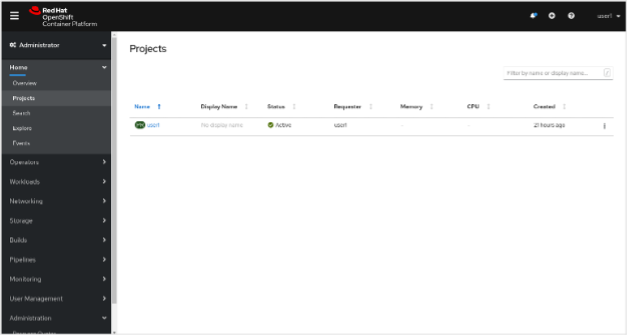
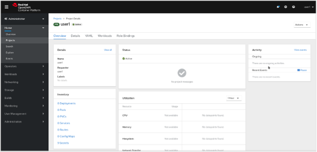
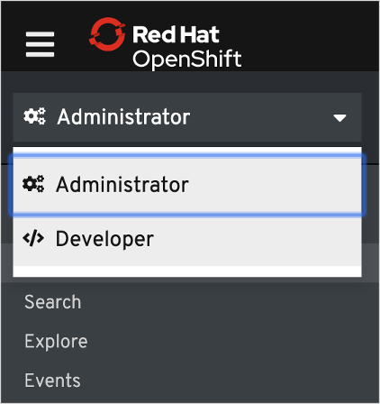
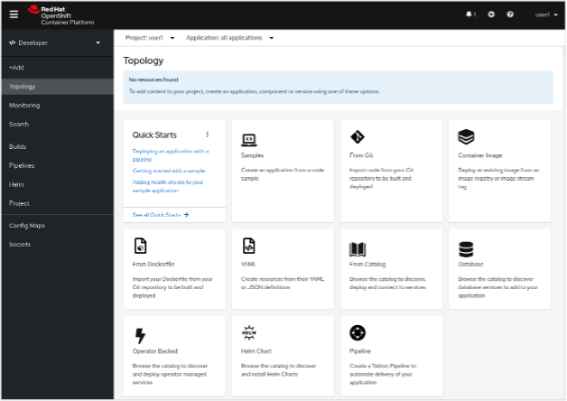

A Quick Overview of How to Interact With OpenShift
------------------------------------------------

Command Line Interface
#######################

OpenShift includes a feature-rich web console with both an Administrator perspective and a Developer perspective. In addition to the web console, OpenShift includes command line tools to provide users with a nice interface to work with applications deployed to the platform. The oc command line tool is an executable written in the Go programming language and is available for the following operating systems:

   - Microsoft Windows
   - macOS 10
   - Linux
  
This lab environment already has the *oc* command line tool installed on the Bastion so you won’t need to install it on your local machine if you do not want to.

Using a Project
###############

Projects are a top level concept to help you organize your deployments. An OpenShift project allows a community of users (or a user) to organize and manage their content in isolation from other communities. Each project has its own resources, policies (who can or cannot perform actions), and constraints (quotas and limits on resources, etc). Projects act as a "wrapper" around all the application services and endpoints you (or your teams) are using for your work.

The Web Console
################

OpenShift ships with a web-based console that will allow users to perform various tasks via a browser.
The first time you access the web console, you will most likely be in the Administrator perspective. You will be presented with the list of Projects that you can access, and you will see something that looks like the following image:

   |image001|

Click on a project link. When you click on the project, you will be taken to the project details page, which will list some metrics and details about your project. 

   |image002|

At the top of the left navigation menu, you can toggle between the Administrator perspective and the Developer perspective.

   |image003|

Select Developer to switch to the Developer perspective. Once the Developer perspective loads, you should be in the Topology view. 

   |image004|

Select Administrator to switch back to the Administrator perspective. Once the Administrator perspective loads, you should be in the Overview view. 

   |image001|

We will be using a mix of command line tooling and the web console for the labs. Get ready!

 

.. _`NGINX Kubernetes Ingress Controller | Deployment`: lab01.html
