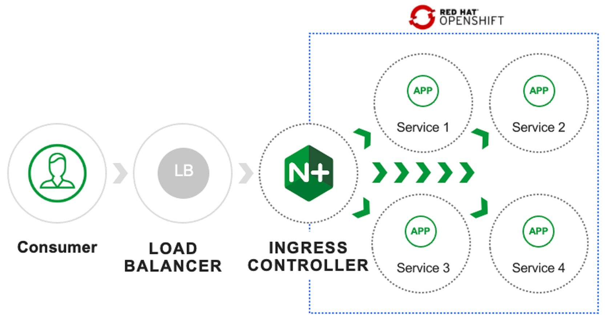

Module 1 - NGINX Kubernetes Ingress Controller For OpenShift
---------------------------------------------------------

|image00|

Welcome to Module 1 of our lab guide, where we will be exploring the deployment of a modern application using the NGINX Ingress Controller for Red Hat OpenShift. This solution is designed to provide a comprehensive guide to successfully deploying an application with the NGINX Ingress Controller, including step-by-step instructions and helpful notes. Additionally, we will share relevant deployment styles for modern applications through practical examples.

Our NGINX Ingress Controller solution can run on multiple clouds and the documents below provide a clear order of operation for deploying an application with NGINX Ingress Controller. It is important to note that these steps assume you are using the Red Hat Demo System.

By the end of this module, you will be able to configure and deploy an application using the NGINX Ingress Controller, with an expected completion time of 1 hour. Our lab guide is divided into four main sections, including:
The Module is expected to take around **1 hour** to complete, and it consists of the following main steps:
Expected time to complete: **1 hour**

.. toctree::
   :maxdepth: 1
   :numbered:
   :glob:
   
   lab*

.. warning:: The steps assume you are using the **Red Hat Demo Platform (RHDP)**

