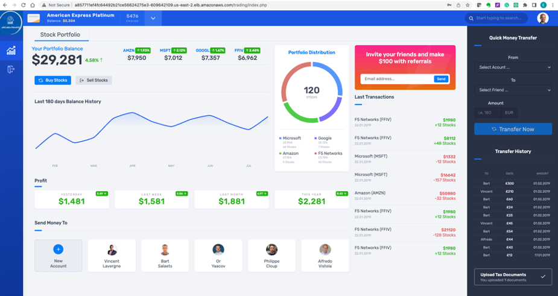

Access Arcadia app without NGINX App Protect
------------------------------------------------

Publish Arcadia app with NGINX Plus Ingress Controller
#######################################################

.. note::  The Arcadia Financial application is the same application we introduced in Module 1, but a different version with enhanced features which will be used for our security lab exercises.

1. Deploy the Arcadia Application into Kubernetes

   The Arcadia Application deployment is a single manifest file containing the resources need to build.

   - Kubernetes deployment for the four docker containers
   - Kubernetes services for the four docker containers

   Get the yaml file. In the terminal window, copy the below text and paste+enter:

   .. code-block:: bash

    wget https://raw.githubusercontent.com/ericzji/nginx-openshift-lab/main/docs/class1/module4/templates/arcadia-all.yaml

   Apply the updated yaml file. In the terminal window, copy the below text and paste+enter:

   .. code-block:: bash

      oc apply -f ./arcadia-all.yaml

2. Arcadia application Kubernetes objects

   In the terminal window, copy the below text and paste+enter:

   .. code-block:: bash

      oc get services

   Example:

3.  Export the NGINX Ingress Controller services

    Interacting with the NGINX Ingress Controller is more comfortable with exporting the service External IPs into system variables. This allows for templating to take place when we expose our applications.

    In the terminal window copy the below text and paste+enter:

    .. code-block:: bash

       export dashboard_nginx_ingress=$(oc get svc dashboard-nginx-ingress --namespace=nginx-ingress | tr -s " " | cut -d' ' -f4 | grep -v "EXTERNAL-IP")

    .. code-block:: bash

       export nginx_ingress=$(oc get svc my-nginx-ingress-controller-nginx-ingress --namespace=nginx-ingress | tr -s " " | cut -d' ' -f4 | grep -v "EXTERNAL-IP")

4. Publish Arcadia app with NGINX Plus Ingress Controller

   Re-create NGINX Ingress Controller with Basic HTTP:

   In the terminal window, copy the below text and paste+enter:

   .. literalinclude :: templates/ingress-arcadia.yml
      :language: yaml

Access the Arcadia application
#################################
launch a Firefox browser and click on the Arcaida Finance bookmark.

You should be presented with the Main page, click on Login and enter the credentials as below.

.. code-block:: 

    Username: matt
    Password: ilovef5

When you click on Log me in, you should be presented with Arcadia application that consist of four microservices

Congratulations!

You have now successfully deployed the application in K8s cluster and published it externally using the NGINX Plus Ingress controller

Is our application protected against Layer 7 attacks?
######################################################
 
We deployed and published the application, but is our application protected against web application attacks? Let's find out by executing a simple XSS attack. XSS is one of the well know OWASP top 10 attack.

- Launch the Firefox browser and execute a XSS attack by appending the ``?a=`` to the application URL, this request is also allowed and a bad actor has successfully stealed your document cookie by luring you to his website.

.. image:: ./pictures/image12.png
   :align: center

Now that we know our application is vulnerable to Layer 7 attacks, we will address this in this Lab and protect our application using NGINX App Protect (NAP)

