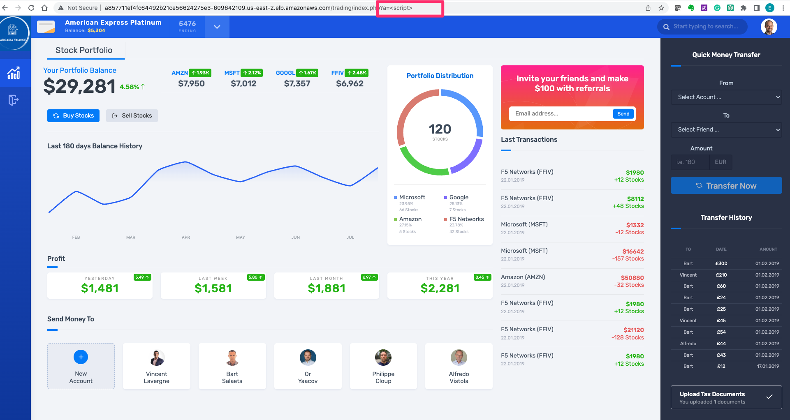
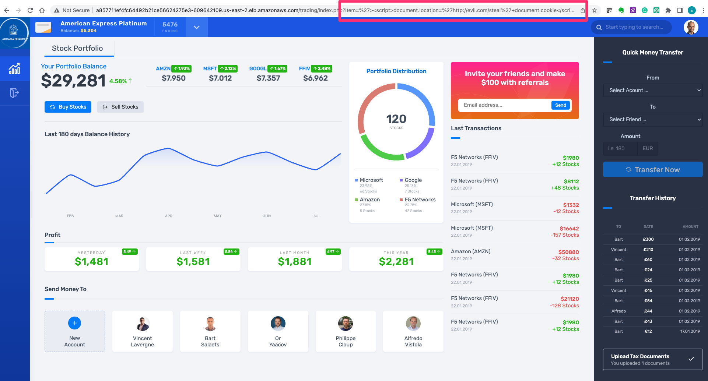

Access Arcadia app without NGINX App Protect to establish a baseline
------------------------------------------------

Cleanup Process
###############
Upon the completion of Lab Module 1, it's necessary to tidy up the lab environment. Please follow the steps mentioned below.

Execute the following commands in the bash terminal:

    .. code-block:: bash
      
       oc delete  virtualserver arcadia
       oc delete  -f arcadia.yml 

Deploy the Arcadia Application into Kubernetes
#######################################################

   .. note::  The Arcadia Financial application is the same application we introduced in Module 1, but a different version with enhanced features which will be used for our security lab exercises.

   Before we can access the Arcadia application, we need to deploy it into our Kubernetes cluster. To do this, we'll use a single manifest file that contains the necessary resources, such as Kubernetes deployments for the four Docker containers and Kubernetes services for the four Docker containers.

   To get the YAML file, we'll use the following command in our terminal window:

   .. code-block:: bash

    wget https://raw.githubusercontent.com/ericzji/nginx-openshift-lab/main/docs/class1/module2/templates/arcadia-all.yaml

   Once we have the YAML file, we can apply it to our Kubernetes cluster with the following command:

   .. code-block:: bash

      oc apply -f ./arcadia-all.yaml

   We can check that our Arcadia application is running by using the following command in our terminal window:

   .. code-block:: bash

      oc get services

   This will show us the services running in our Kubernetes cluster, including those related to the Arcadia application.

Export the NGINX Ingress Controller services
#######################################################

    Interacting with the NGINX Ingress Controller is more comfortable with exporting the service External IPs into system variables. This allows for templating to take place when we expose our applications.

    In the terminal window copy the below text and paste+enter:

    .. code-block:: bash

       export nginx_ingress=$(oc get svc my-nginx-ingress-controller --namespace=nginx-ingress | tr -s " " | cut -d' ' -f4 | grep -v "EXTERNAL-IP")

Publish Arcadia app with NGINX Plus Ingress Controller
########################################################

   Now that we have our Arcadia application deployed in our Kubernetes cluster, we need to publish it using the NGINX Plus Ingress Controller. We'll do this by re-creating the NGINX Ingress Controller with Basic HTTP using the following command in our terminal window:

   .. literalinclude :: templates/ingress-arcadia.yml
      :language: yaml

   This command creates a VirtualServer resource for our Arcadia application, which includes the host for the NGINX Ingress Controller and the upstreams for the different microservices. We can now access our Arcadia application externally using the NGINX Ingress Controller URL, which can be found by running the following command in our terminal window:

       .. code-block:: bash

         echo "NGINX Ingress Controller URL: http://$nginx_ingress/"

   Once we have the URL, we can access our Arcadia application by opening it in a web browser.

   You should be presented with the Main page, click on Login and enter the credentials as below.

   .. code-block:: 

      Username: matt
      Password: ilovef5

   When you click on Log me in, you should be presented with Arcadia application that consist of four microservices

   .. image:: ./pictures/image10.png
      :align: center

   Congratulations!

   You have now successfully deployed the application in K8s cluster and published it externally using the NGINX Plus Ingress controller

Is our application protected against Layer 7 attacks?
######################################################
 
Before we can protect our Arcadia application with NGINX App Protect, we need to check if it's currently vulnerable to Layer 7 attacks. We can do this by executing a simple XSS attack, which is a well-known OWASP top 10 attack.

To perform the XSS attack, we can launch the Firefox browser and append ``?a=`` to the application URL, which will attempt to steal our document cookie. If this request is also allowed, then a bad actor could potentially steal sensitive information from our application user

Since our application is currently vulnerable to Layer 7 attacks, we'll need to protect it using NGINX App Protect in the following Lab.

