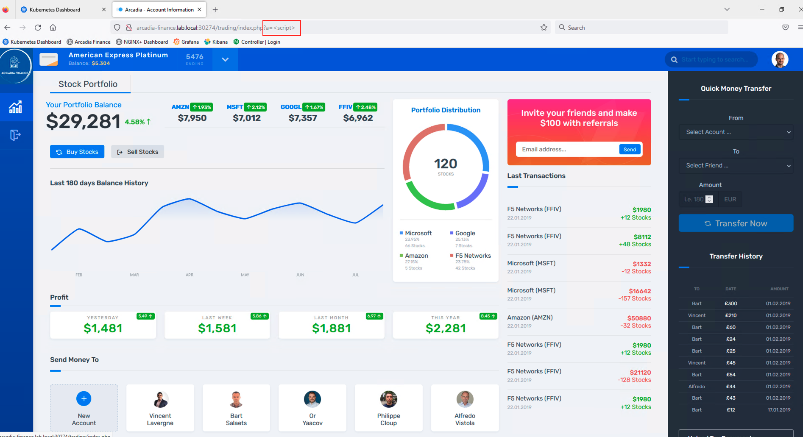
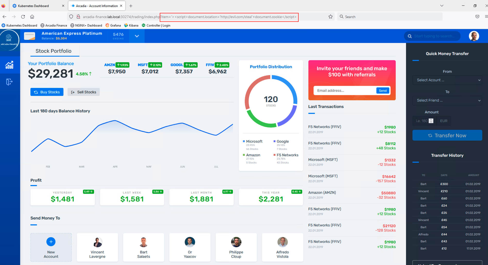

Is our application protected against Layer 7 attacks?
######################################################

In Lab1, we deployed and published the application, but is our application protected against web application attacks? Let's find out by executing a simple XSS attack. XSS is one of the well know OWASP top 10 attack.

From the Jumpbox, launch the Firefox browser and execute a XSS attack by appending the ?a= to the application URL, this request is also allowed and a bad actor has successfully stealed your document cookie by luring you to his website.

Now that we know our application is vulnerable to Layer 7 attacks, we will address this in this Lab and protect our application using NGINX App Protect (NAP)

