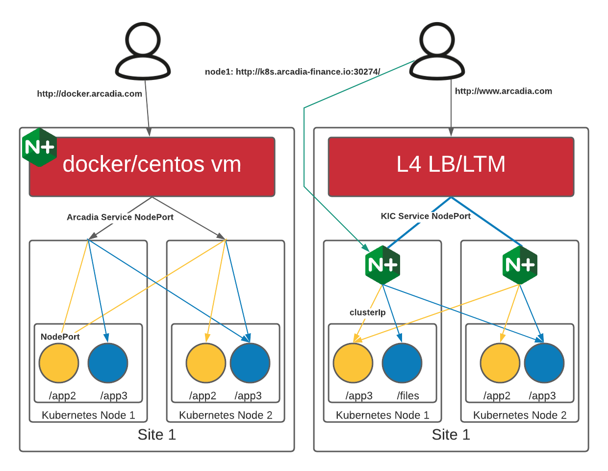

Deploy NGINX Plus Ingress Controller with NAP
-----------------------------------------------------------

Deployment Overview
#####################
In Lab 1, the ingress controller has already been deployed and we will focus on the items that are specific to configuring NGINX App Protect.

That said, if you are interested in the topology or deploying the ingress controller, please continue on with this step. Otherwise you can skip to module 5: protecting API workloads.

At a high-level we will:

  #. Configure role-based access control (RBAC)
  #. Create the common Kubernetes resources
  #. Install the Ingress Controller with NGINX App Protect WAF
  #. Configure the NGINX App Protect WAF module
  #. Attach NAP Policy to the NGINX Ingress Controller’s Virtual Server

Clone the Ingress Controller repo and change into the deployments folder:
   .. code-block::

      git clone https://github.com/nginxinc/kubernetes-ingress.git --branch v2.4.2
      cd kubernetes-ingress/deployments

Configure role-based access control (RBAC)
##########################################
For NGINX Ingress Controller in Lab 1, we already created:

- a namespace and a service account for the Ingress Controller
- a cluster role and cluster role binding for the service account
  
To use the App Protect WAF module, we also need to create the App Protect role and role binding:

   .. code-block::

      oc apply -f rbac/ap-rbac.yaml

Create the common Kubernetes resources
#######################################
For NGINX Ingress Controller in Lab 1, we already created the resources:

- a secret with a TLS certificate and a key for the default server in NGINX:
- a config map for customizing NGINX configuration
- an IngressClass resource

No additional common resource is needed for the App Protect WAF module.
  
Create Custom Resources
########################
For NGINX Ingress Controller in Lab 1, we already created custom resource definitions for VirtualServer and VirtualServerRoute, TransportServer and Policy resources.

To use the App Protect WAF module, create the following additional resources:

Create a custom resource definition for APPolicy, APLogConf and APUserSig:

    .. code-block:: bash
    
       oc apply -f common/crds/appprotect.f5.com_aplogconfs.yaml
       oc apply -f common/crds/appprotect.f5.com_appolicies.yaml
       oc apply -f common/crds/appprotect.f5.com_apusersigs.yaml

Update the Ingress Controller with NGINX App Protect WAF
##########################################################

**Steps**

    #.  Check the existing ``ingress`` already deployed and running. 

        .. code-block:: bash
          :caption: helm removal

    #.  update the ingress controller

            .. code-block:: yaml

                apiVersion: charts.nginx.org/v1alpha1
                kind: NginxIngress

                spec:
                controller:
                    appprotect:
                    enable: True

                    image:
                    pullPolicy: IfNotPresent
                    repository: ericzji/nginx-plus-ingress-nap
                    tag: 2.4.1-ubi

    #.  After running the command, we need to wait for the KIC pod to become available. you can use a command like:

        .. code-block:: BASH

           oc get pods --all-namespaces --watch

    #.  Once it we have 1/1 ``plus-nginx-ingress`` ready. You can press ``ctrl-c`` to stop the watch.

        .. image:: ./pictures/ingress-ready.png

Configure the NGINX App Protect WAF module
###########################################
Now, it is time to configure the Ingress Controller with CRD ressources (WAF policy, Log profile, Ingress routing ...)

**Steps**

Execute the following commands to deploy the different resources
    
    .. code-block:: bash
          
       cd /home/lab-user/kubernetes-ingress/examples/custom-resources/app-protect-waf
          
       oc apply -f syslog.yaml
       oc apply -f ap-apple-uds.yaml
       oc apply -f ap-dataguard-alarm-policy.yaml
       oc apply -f ap-logconf.yaml
       oc apply -f waf.yaml

  1. The manifest ``ap-dataguard-alarm-policy.yaml`` creates the WAF policy
 
    .. literalinclude :: ./templates/ap-dataguard-alarm-policy.yaml
       :language: yaml

  2. The manifest ``ap-logconf.yaml`` creates the Log Profile to send logs to ELK
 
      .. literalinclude :: ./templates/ap-logconf.yaml
       :language: yaml

  3. The manifest ``waf.yaml`` creates the WAF config (policy + log)
 
    .. literalinclude :: ./templates/waf.yaml
       :language: yaml

Atth NAP Policy to the NGINX Ingress Controller’s Virtual Server
######################################################################
It is important that the application always have WAF protecting it. 

To enable NAP, a Virtual Server in NGINX Ingress Controller requires both a Policy and an APPolicy custom resource to be attached to it. You simply need to add the reference to the Virtual Server.

**Steps**

#. Examine the contents of the **VirtualServer** resource, which is contained in the **kic-vs.yml** file.

#. update VirtualServer "oc edit virtualserver arcadia"
#. Add the following content to the lines immediately following `host: $nginx_ingress`, at the same indentation level:

          .. code-block:: yaml
            
             policies:
             - name: waf-policy

.. code-block:: yaml

   apiVersion: k8s.nginx.org/v1
   kind: VirtualServer
   metadata:
     name: arcadia
   spec:
     host: $nginx_ingress
     policies:
     - name: waf-policy
     upstreams:
     - name: arcadia-main
       service: arcadia-main
       port: 80
     - name: arcadia-app2
       service: arcadia-app2
       port: 80
     - name: arcadia-app3
       service: arcadia-app3
       port: 80
