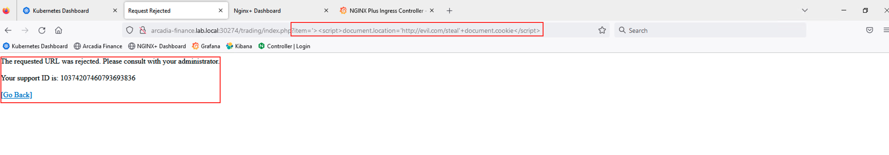
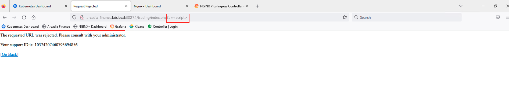

Access the Application and Test the WAF
-----------------------------------------------------------

We knew that NAP provides protection against Layer 7 attacks, lets find out the security posture of our application.

Launch the Firefox browser from Jumpbox and click on bookmark Arcadia Finance, this should open a landing page, click on login and provide the credentials as before and log into the application
  
    #. In the Browser, click on the bookmark ``Aracdia Links>Arcadia NAP Centos``
    #. Click on ``Login``
    #. Login with ``matt:ilovef5``
    #. You should see all the apps running (main, back, app2 and app3)

    #.  Try some attacks like injections or XSS: ``http://app-protect-centos.arcadia-finance.io/<script>``

- Now execute the same XSS attack that we did in Module1, observe the attack is blocked now and the user is provided with a support ID

You will be blocked and see the default Blocking page

        .. code-block:: html
            
                The requested URL was rejected. Please consult with your administrator.
            
                Your support ID is: 14609283746114744748
            
                [Go Back]
                
        .. note:: Did you notice the blocking page is similar to F5 ASM and Adv. WAF ?

- Execute the second attack from Module 1 and observe the results

 

**Here are some optional attacks you can try**

``SQL Injection - GET /?hfsagrs=-1+union+select+user%2Cpassword+from+users+--+``

``Remote File Include - GET /?hfsagrs=php%3A%2F%2Ffilter%2Fresource%3Dhttp%3A%2F%2Fgoogle.com%2Fsearch``

``Command Execution - GET /?hfsagrs=%2Fproc%2Fself%2Fenviron``

``HTTP Parser Attack - GET /?XDEBUG_SESSION_START=phpstorm``

``Predictable Resource Location Path Traversal - GET /lua/login.lua?referer=google.com%2F&hfsagrs=%2F..%2F..%2F..%2F..%2F..%2F..%2F..%2F..%2Fetc%2Fpasswd``

``Cross Site Scripting - GET /lua/login.lua?referer=google.com%2F&hfsagrs=+oNmouseoVer%3Dbfet%28%29+``

``Informtion Leakage - GET /lua/login.lua?referer=google.com%2F&hfsagrs=efw``

``HTTP Parser Attack Forceful Browsing - GET /dana-na/auth/url_default/welcome.cgi``

``Non-browser Client,Abuse of Functionality,Server Side Code Injection,HTTP Parser Attack - GET /index.php?s=/Index/\think\app/invokefunction&function=call_user_func_array&vars[0]=md5&vars[1][]=HelloThinkPHP``

``Cross Site Scripting - GET / HTTP/1.1\r\nHost: <ATTACKED HOST>\r\nUser-Agent: Mozilla/5.0 (Windows NT 10.0; Win64; x64; rv:62.0) Gecko/20100101 Firefox/62.0\r\nAccept: */*\r\nAccept-Encoding: gzip,deflate\r\nCookie: hfsagrs=%27%22%5C%3E%3Cscript%3Ealert%28%27XSS%27%29%3C%2Fscript%3E\r\n\r\n"``

.. code-block :: bash

    #!/bin/bash
    echo "------------------------------"
    echo "Starting security testing..."
    echo "------------------------------"
    echo ""
    echo ""
    echo "---------------------------------------------------------------------"
    echo "Multiple decoding"
    echo "Sending: curl -k 'http://app-protect-centos.arcadia-finance.io/three_decodin%2525252567.html'"
    echo "---------------------------------------------------------------------"
    curl -k "http://app-protect-centos.arcadia-finance.io/three_decodin%2525252567.html"
    sleep 3
    echo "-----------------------------------------------------------------------------"
    echo "Apache Whitespace"
    echo "Sending: curl -k 'http://app-protect-centos.arcadia-finance.io/tab_escaped%09.html'"
    echo "-----------------------------------------------------------------------------"
    curl -k "http://app-protect-centos.arcadia-finance.io/tab_escaped%09.html"
    sleep 3
    echo "-----------------------------------------------------------------------------"
    echo "IIS Backslashes"
    echo "Sending: curl -k 'http://app-protect-centos.arcadia-finance.io/regular%5cescaped_back.html'"
    echo "-----------------------------------------------------------------------------"
    curl -k "http://app-protect-centos.arcadia-finance.io/regular%5cescaped_back.html"
    sleep 3
    echo "-----------------------------------------------------------------------------"
    echo "Apache Whitespace"
    echo "Sending: curl -k 'http://app-protect-centos.arcadia-finance.io/carriage_return_escaped%0d.html?x=1&y=2'"
    echo "-----------------------------------------------------------------------------"
    curl -k "http://app-protect-centos.arcadia-finance.io/carriage_return_escaped%0d.html?x=1&y=2"
    sleep 3
    echo "-----------------------------------------------------------------------------"
    echo "Cross site scripting"
    echo "Sending: curl -k 'http://app-protect-centos.arcadia-finance.io/%25%25252541PPDATA%25'"
    echo "-----------------------------------------------------------------------------"
    curl -k "http://app-protect-centos.arcadia-finance.io/%25%25252541PPDATA%25"    